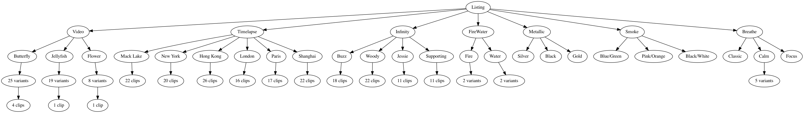

## Motion

A watchOS app to view the watch faces with moving backgrounds ("Fire and Water", "Liquid Metal", "Motion", "Timelapse", "Toy Story", "Vapor") without the clock overlays.

### Research

This project involved reverse engineering the NanoTimeKit (private) framework, and private components of the (public) ClockKit framework.
All research was conducted on watchOS 7.1 (18R590).

The `NanoTimeKit.framework` directory in this repository contains a tbd that was generated using [github.com/inoahdev/tbd](https://github.com/inoahdev/tbd), and that I've modified.

All private headers in this repository were generated using [github.com/leptos-null/ClassDumpRuntime](https://github.com/leptos-null/ClassDumpRuntime), and that I've modified.

